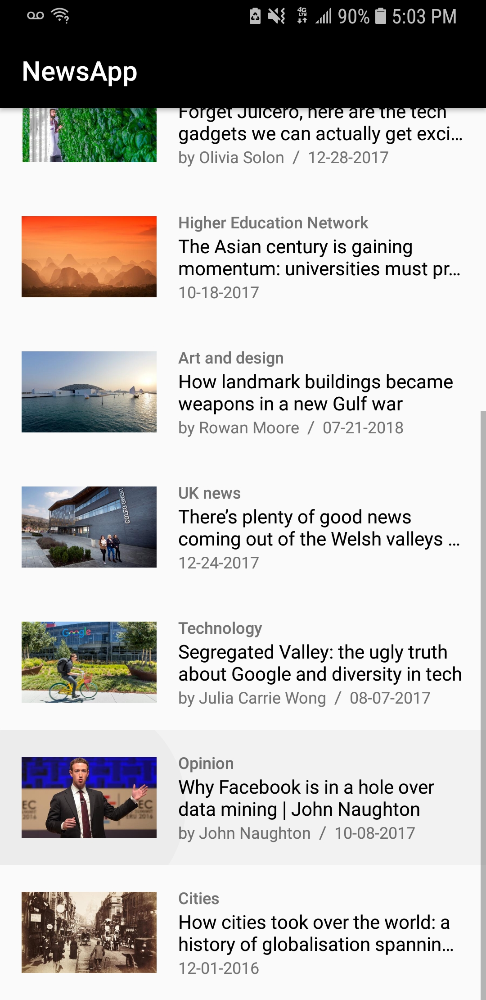

# NewsApp

## Synopsis

Name: News App I

This is an Android news application.

The purpose of the application is to create a news application which parses an URL from The Guardian and allows the user to read
new items from a list. 

The user can click on any news item in the list and read a web view of the story in detail.

 <kbd></kbd><kbd></kbd>

## Code Description

The key features in the application are:  NewsActivity, News, NewsAdapter, NewsLoader, and QueryUtils

Structure of the code derives from the Earthquare application used in class: 
https://github.com/udacity/ud843-QuakeReport  

## Motivation

This is the sixth exercise in the "Grow with Google - Android Basic Development Nanodegree Scholarship 2018" program with Udacity.

The purpose of the exercise is to create a "News app."

## Installation

Project can be downloaded from GitHub:  https://github.com/hillc255/NewsApi 

## API Reference

Source of content comes from the open-source API from "The Guardian." 
https://open-platform.theguardian.com/documentation/   

## Tests (Future consideration!)

Describe and show how to run the tests with code examples.

## Contributors

Claudia Hill designed and developed this project.

## License

Only to be used for educational purposes.
